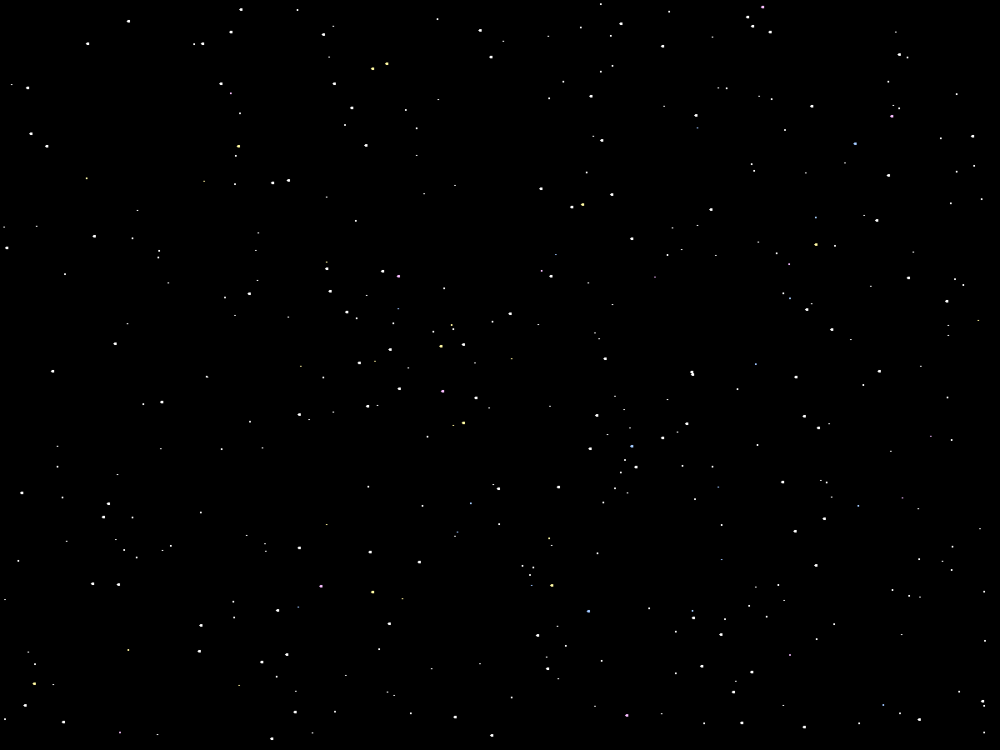
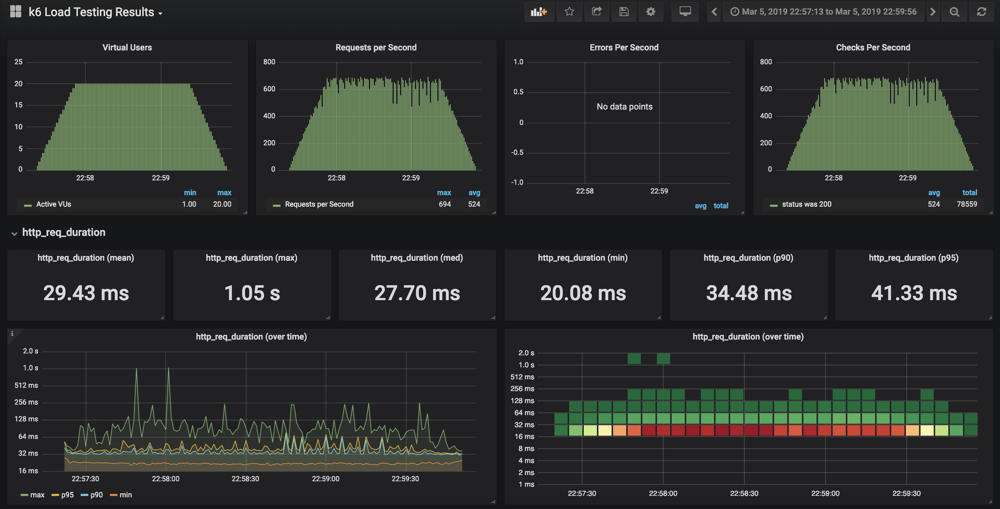

# starry-sky-service
API Gateway + Lambda based service that generates a starry sky image.

#### Try it out!

Generate a starry sky:

https://api.mycodefu.com/starry/sky.png?width=1200&height=900

e.g.

##### Performs well!

Used the awesome K6 with this script:
https://gist.github.com/luketn/48bfeaad2841d0b006f1a8c81b46da22
